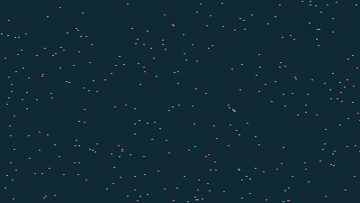

# Secrets for Nicotine - Wallpaper Engine & Web Recreation

> **Interactive visual recreation in HTML5 / Canvas based on the classic Flash visualizer `SaturatedDreams.swf`.**



---

## 📖 Project Overview

**SaturatedDreams** is an interactive, audio-reactive 3D particle visualizer and live wallpaper adapted for **Wallpaper Engine** and modern web browsers using **HTML5 Canvas** and **JavaScript**.

The original project was developed in Flash / Flex (ActionScript 3) by **[nl.barcinski](https://barcinski.nl/)**. This version attempts to port the experience I spent hours watching as a kid to open web technologies, bringing back that feeling of being a kid with nothing to do but watch and play Flash stuff.

---

## ⚠️ Note on Port Fidelity

> [!NOTE]
> **This is not a 1:1 identical recreation**, but it was developed to be **as faithful and close as possible** to the original (basically skill issue).

---

## 🛠️ Acknowledgements & Decompilation

This project was made possible thanks to:

* **[nl.barcinski](https://barcinski.nl/)**: Original creator of the visual concept and Flash animation.
* **Sheryl Chan**: Composer and performer of the original music (*Secrets for Nicotine*), responsible for creating the track.
* **[JPEXS Free Flash Decompiler (FFDec)](https://github.com/jindrapetrik/jpexs-decompiler)**: Essential FOSS tool that allowed decompiling and analyzing the original `SaturatedDreams.swf` file. Through the ActionScript 3 source code (`SaturatedDreams.as`, `ParticlesEngine`, `PointEngine`, `BeatEngine`, `Peak`, `Subband`, `EffectRotator`, `Animations.spring`, etc.), it was possible to extract mathematical formulas, camera parameters, beat detection algorithms, and 3D geometries.

---

## ✨ Key Features

### 🌀 3D Geometries & Shapes
* **Shapes:**
  * `FilledCube` (Solid cube with a 3D distribution on a regular grid).
  * `Cube` (Hollow cube across exterior faces).
  * `Spiral` (Spirals with various frequencies and harmonic sinusoidal modulations).
  * `StrangeAttractor` (Chaotic 3D attractors based on non-linear dynamic systems).
  * `Cylinder` (Particle cylinder).
  * `Torus` (Particle torus).

### 🎨 Color Schemes & Views
* **`BlackYellow`**: Deep black background (`#000000`) with vibrant yellow particles (`#E7FB15`).
* **`PetrolPink`**: Dark petrol background (`#0A3C41`) with pinkish-toned particles (`#E59AA6`, `#EE5D80`).
* **`PixelView`**: High-density monochrome view with up to 40,000 black micro-points on a pure white background (`#FFFFFF`).

### ⚡ Physics & Dynamics
* **Fluid Mode (`Animations.spring`):** Spring physics system with tension and damping coefficients that smoothly interpolates each particle's position toward the new target shape (`target`).
* **Erratic Transitions:** Direct position snaps with random velocity impulses to create sharp, energetic shifts in sync with the beat.
* **3D Projection:** Camera with focal distance (`focal: 480`), relative depth, and depth sorting along the Z-axis (`zSort`).
* **Interactive Camera:** Smooth scene rotation controlled by mouse/cursor movement.

### 🎵 Audio Reactivity
* **Integrated BeatEngine:** Emulation of the 32 sub-band spectrum analysis system with peak detection (lows, mids, and highs).
* **Local Audio:** Includes the original music track *Secrets for Nicotine* (`assets/Saturated_Dreams_1_0.mp3`), composed and performed on piano by **Sheryl Chan**.
* **System Audio (Wallpaper Engine):** Native integration with `wallpaperRegisterAudioListener`, allowing particles and shapes to pulse to the rhythm of any audio playing on your PC (Spotify, YouTube, games, etc.).

---

## 📁 Repository Structure

```text
├── assets/
│   ├── Saturated_Dreams_1_0.mp3  # Original looping music track
│   └── SaturatedDreams.swf       # Original Flash SWF file
├── index.html                    # Main HTML5/Canvas application
├── project.json                  # Wallpaper Engine manifest & properties
├── preview.jpg                   # Preview image
├── ruffle.html                   # Original SWF player via Ruffle
└── README.md                     # Project documentation
```

---

## ⚙️ Configurable Properties (Wallpaper Engine)

| Property | Type | Description |
| :--- | :--- | :--- |
| `schemecolor` | Combo | Color scheme selection (Auto-Random, Petrol Pink, Black Yellow, etc.) |
| `particlecount` | Slider | Number of particles on screen (800 – 6000) |
| `particlesize` | Slider | Render size of each particle |
| `rotationspeed` | Slider | Rotation sensitivity when moving the mouse |
| `shapetime` | Slider | Time interval between geometric shape changes |
| `playmusic` | Bool | Play or pause the built-in background music |
| `musicvolume` | Slider | Volume level of the built-in music track |
| `beatreactive` | Bool | Enable automatic beat-driven shape transformations |
| `usemicrophone` | Bool | Use the Wallpaper Engine system audio listener |

---

## 📄 License & Credits

* **Original Flash visual concept and programming**: [nl.barcinski (barcinski.nl)](https://barcinski.nl/)
* **Original music (Piano)**: Sheryl Chan (*Secrets for Nicotine*)
* **Decompilation and research**: Conducted using [JPEXS Free Flash Decompiler (FFDec)](https://github.com/jindrapetrik/jpexs-decompiler).
* **Port and adaptation to Canvas/Wallpaper Engine**: Recreation for the community.
